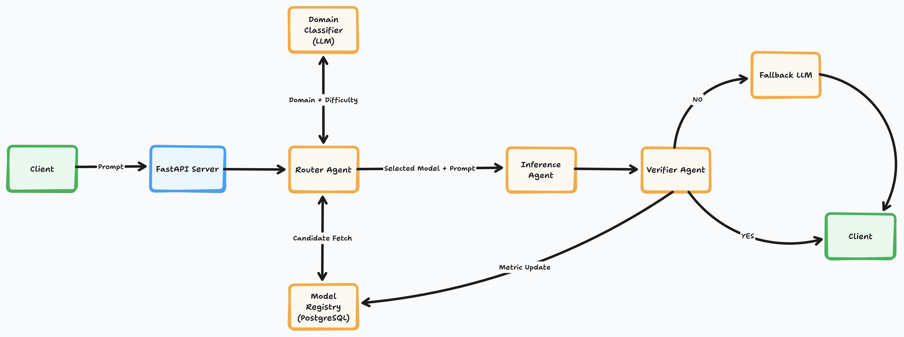

# 🧠 HyRA: Hybrid Routing Agent Framework

**HyRA** (Hybrid Routing Agent Framework) is a modular, agent-driven system for managing LLM routing, verification, and capability tracking across multiple open-source LLMs.

---

## 🚀 Overview

HyRA provides a foundation for:
- **Routing** queries across multiple models (RouterAgent)
- **Verifying** and scoring outputs (VerifierAgent)
- **Tracking** metrics like latency, accuracy, and cost (ModelRegistry)
- **Serving** results via a FastAPI interface (API Service)

---

System Architecutre:



This setup includes:
- 🐍 Python 3.11
- ⚡ FastAPI + Uvicorn

## ⚙️ Setup Instructions

### 1️⃣ Clone and enter the repo
```bash
git clone https://github.com/UmarAhmed30/hybrid-routing-agents-framework.git
cd hybrid-routing-agents-framework
```

---

## 🧩 Maintainers
**Umar Ahmed Thameem Ahmed**
CS Graduate Student, University of Colorado Boulder
📧 `umar.ahmed.t.30@gmail.com`

**Sahil Shroff**
CS Graduate Student, University of Colorado Boulder
📧 `sahil.shroff@colorado.edu`

---